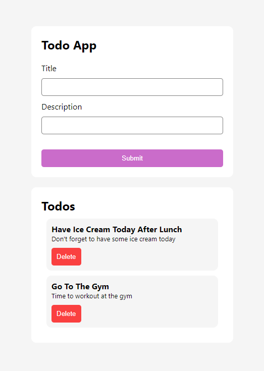
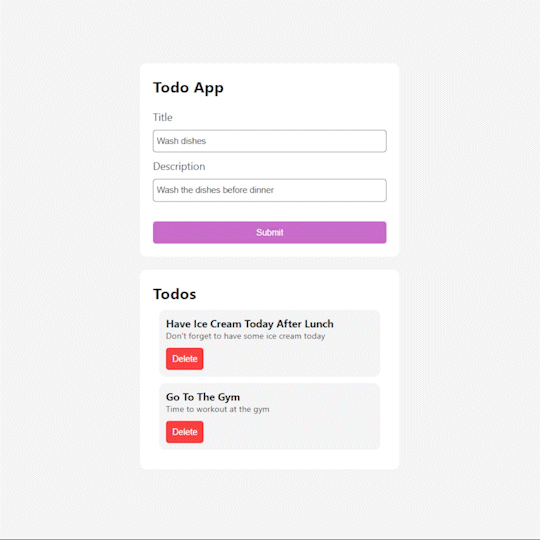
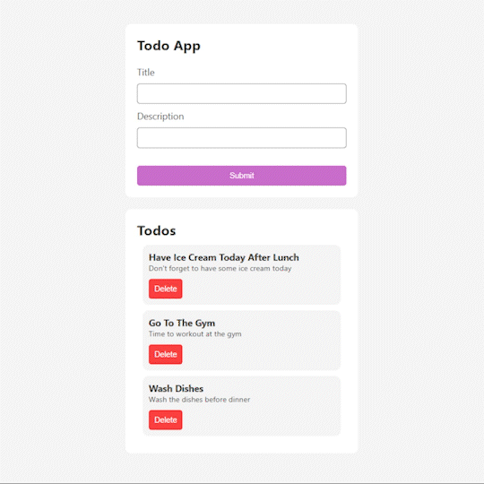

# My ToDo App



Developed a basic todo website that can create, display list of todos and delete a specific todo from the list.

This project only contains the frontend of the website, the backend program is available in the `solutions` branch of [100xDevs-Week-2-Assignments](https://github.com/Tejas-Bangera/100xDevs-Week-2-Assignments/blob/solutions/02-nodejs/todoServer.js) repository.

## Create a ToDo



- Used `useEffect` hook and `fetch` to get the list of todos from the todos server listening on port 4000.
- Array of todos and setTodos function are created with `useState` hook to dynamically render the todos on update.
- The `Submit` button will send a `POST` request with title and description in the request body to the backend server which will create the ToDo and on successful creation sends back a `200` response with list of updated todos.
- The updated todos is then updated in the `useState` variable.

## Delete a ToDo



- The Delete button will send a `DELETE` request with the id seleted ToDo to be deleted to the backend server.
- The route of the backend server will process this request accessing the todo id from the query parameter and find and delete the todos from the todos list.
- On success it returns a `200` response with the list of updated todos which is then updated using the `useState` todos variable.

This project was bootstrapped with [Create React App](https://github.com/facebook/create-react-app).

## Project Setup and Run

#### :warning: Note: Before you run this application make sure you have the backend server up and running!

After **cloning** the project locally, go to `/todo-app-api` directory in your local machine and run the below command to install all the dependencies.

```bash
npm install
```

and run todo server using the below command.

```bash
node todoServer.js
```

With the backend server up and running, setup this project locally on your device by cloning it.

Get into the `/todo-app-client` directory and run the below command to install dependencies

```bash
npm install
```

Run the application

```bash
npm start
```

Open http://localhost:3000 to view it in your browser.

## Available Scripts from Create-React-App

In the project directory, you can run:

### `npm start`

Runs the app in the development mode.\
Open http://localhost:3000 to view it in your browser.

The page will reload when you make changes.\
You may also see any lint errors in the console.

### `npm test`

Launches the test runner in the interactive watch mode.\
See the section about [running tests](https://facebook.github.io/create-react-app/docs/running-tests) for more information.

### `npm run build`

Builds the app for production to the `build` folder.\
It correctly bundles React in production mode and optimizes the build for the best performance.

The build is minified and the filenames include the hashes.\
Your app is ready to be deployed!

See the section about [deployment](https://facebook.github.io/create-react-app/docs/deployment) for more information.

### `npm run eject`

**Note: this is a one-way operation. Once you `eject`, you can't go back!**

If you aren't satisfied with the build tool and configuration choices, you can `eject` at any time. This command will remove the single build dependency from your project.

Instead, it will copy all the configuration files and the transitive dependencies (webpack, Babel, ESLint, etc) right into your project so you have full control over them. All of the commands except `eject` will still work, but they will point to the copied scripts so you can tweak them. At this point you're on your own.

You don't have to ever use `eject`. The curated feature set is suitable for small and middle deployments, and you shouldn't feel obligated to use this feature. However we understand that this tool wouldn't be useful if you couldn't customize it when you are ready for it.

## Learn More

You can learn more in the [Create React App documentation](https://facebook.github.io/create-react-app/docs/getting-started).

To learn React, check out the [React documentation](https://reactjs.org/).

### Code Splitting

This section has moved here: [https://facebook.github.io/create-react-app/docs/code-splitting](https://facebook.github.io/create-react-app/docs/code-splitting)

### Analyzing the Bundle Size

This section has moved here: [https://facebook.github.io/create-react-app/docs/analyzing-the-bundle-size](https://facebook.github.io/create-react-app/docs/analyzing-the-bundle-size)

### Making a Progressive Web App

This section has moved here: [https://facebook.github.io/create-react-app/docs/making-a-progressive-web-app](https://facebook.github.io/create-react-app/docs/making-a-progressive-web-app)

### Advanced Configuration

This section has moved here: [https://facebook.github.io/create-react-app/docs/advanced-configuration](https://facebook.github.io/create-react-app/docs/advanced-configuration)

### Deployment

This section has moved here: [https://facebook.github.io/create-react-app/docs/deployment](https://facebook.github.io/create-react-app/docs/deployment)

### `npm run build` fails to minify

This section has moved here: [https://facebook.github.io/create-react-app/docs/troubleshooting#npm-run-build-fails-to-minify](https://facebook.github.io/create-react-app/docs/troubleshooting#npm-run-build-fails-to-minify)
